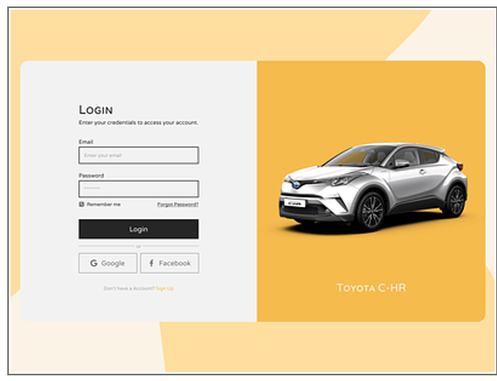
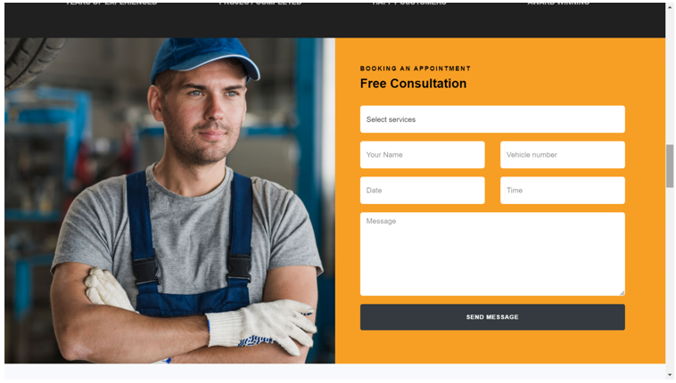

# CarBay
A Progressive Web Application (PWA) to book online car workshop services and purchase car spare parts. The platform enables users to browse workshops, compare products, make secure payments, and schedule repairs—all from a single user-friendly system.

---

##  Abstract

The Web application "CAR BAY" allows users to book online workshop services and buy car spare parts from various stores. The system shows availability and features of cars and spare parts, with options to filter, search, compare, and purchase online.  
Users can view product details, ratings, and make secure payments via credit card. This application integrates car service booking (both in-shop and on-road) with a robust inventory and sales management system, improving convenience and efficiency. It also includes administrative tools and real-time user interaction with workshops.

---

##  Technology Stack

- **Frontend**: HTML, CSS, JavaScript
- **Backend**: PHP
- **Database**: MySQL
- **Web Server**: Apache (via XAMPP)
- **IDE**: Notepad++ / Visual Studio Code
- **Operating System**: Windows 10 / Windows 11

---

##  Module Overview

###  Admin
- Login/Logout  
- Add & view blogs  
- Add & view maintenance tips  
- Respond to user suggestions  

###  User
- Register/Login  
- Manage personal profile  
- Search and book nearby services  
- Submit complaints and feedback  
- View service packages  

###  Workshop
- Register/Login  
- Manage profile, services, and bookings  
- Respond to user feedback  
- Handle complaints  

---

##  Key Features

- Find nearby workshops using current location  
- Book car services (in-shop/on-road)  
- Buy car spare parts with secure checkout  
- Credit card payment integration  
- Rate & review services and products  
- Manage inventory and service listings  
- Secure login and user role-based access  

---

##  Screenshots

---

##  Testing

-Unit Testing (form inputs, role-based actions)
-Integration Testing (between modules: user, admin, workshop)
-Validation Checks (forms, payments, registrations)
-User Acceptance Testing (end-user walkthroughs)

---

##  Future Enhancements

-Mobile app integration
-Live GPS workshop tracking
-Workshop rating system
-Coupon & offer integration
-Push notifications and reminders

---

##  Authors

Ansly Roy (Reg No: SNG22MCA-2024)

Guided by: Asst. Prof. Smitha K. S
Sree Narayana Gurukulam College of Engineering, Kadayiruppu
(Affiliated to APJ Abdul Kalam Technological University, Kerala)

---

##  Academic Context

This project was submitted in partial fulfillment of the requirements for the award of the degree of Master of Computer Applications (MCA), 2023–24.

---

##  License

This project is intended for academic and educational purposes only.
